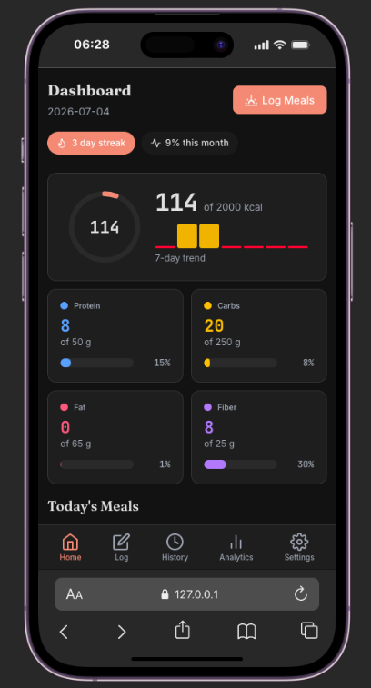
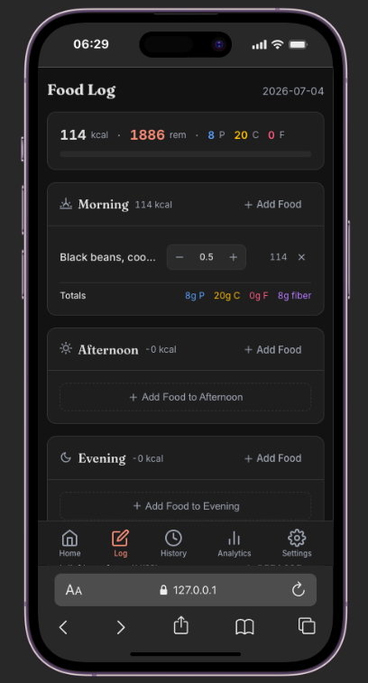
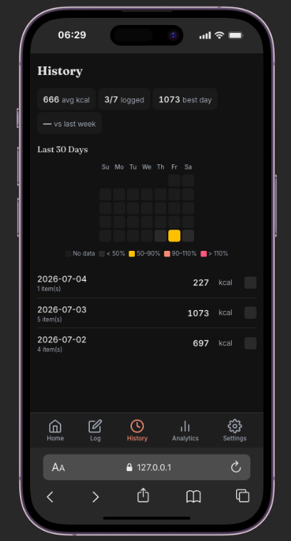
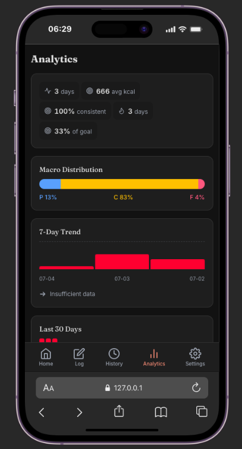

# NutriTrack

**Open-source nutrition tracking web app built with Dioxus 0.7 and Rust**

## About

NutriTrack helps you log meals, track daily nutrition, and analyze your eating habits over time. It runs entirely in the browser using WebAssembly, with data persisted locally via browser storage.

**Key features:**
- Log meals and snacks throughout the day
- View daily history and patterns
- Analytics dashboard for nutrition insights
- Dark, light, and system theme support
- Persistent offline-first storage
- Responsive mobile-first UI with Tailwind CSS

## Preview

| Screen | View |
|--------|------|
| Home |  |
| Log |  |
| History |  |
| Analytics |  |

## Tech Stack

- [Dioxus](https://dioxuslabs.com/) 0.7 — Rust-native UI framework
- [Tailwind CSS](https://tailwindcss.com/) — Utility-first styling
- [serde](https://serde.rs/) + JSON — Local persistence
- [dx](https://dioxuslabs.com/learn/0.7/getting_started/installation.html) — Dev server and build tool

## Getting Started

```bash
dx serve
```

## License

MIT

